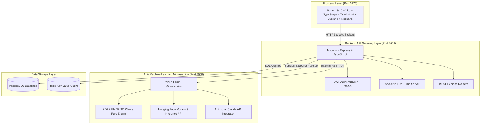

# VitalLoop — Comprehensive Project Details & Technical Architecture Blueprint

**VitalLoop** is an AI-powered digital health and clinical decision support platform for diabetes risk stratification, continuous glucose tracking, food habit intelligence, guided breathing stress reduction, and behavioral AI coaching.

---

## 1. Executive Summary & Vision

VitalLoop is designed around a closed-loop continuous healthcare feedback framework:

```
[ Patient Inputs / CGM ] ──> [ AI & Rule Engine Analysis ] ──> [ Behavioral Risk Prediction ]
           │                                                                    │
           ▼                                                                    ▼
[ Longitudinal Health ] <── [ Actionable Health Outcomes ] <── [ Personalized AI Coaching ]
```

### Key Target User Roles
1. **Individual User (Patient)**: Daily glucose log, meal analysis, box breathing sessions, weight metrics, and AI health coach interactions.
2. **Healthcare Provider (Clinician)**: Patient list overview, high-risk alert management, 14-day ambulatory glucose trends, and clinical intervention tracking.
3. **Institution Admin**: Population health stratification, aggregate diabetes prevalence metrics, adherence reports, and system audit monitoring.
4. **System Service**: Async background workers, Hugging Face AI risk prediction, and real-time alert broadcasts via WebSockets.

---

## 2. Architecture & Service Topology



---

## 3. Implemented Modules & Features

### 3.1 Auth & RBAC
- Role-Based Access Control (`individual`, `provider`, `institution_admin`).
- JWT authentication with refresh token rotation and bcrypt password hashing.

### 3.2 Glucose Management
- Log fasting, pre-meal, post-meal, and bedtime blood glucose readings.
- Automatic computation of mean glucose, estimated HbA1c, and time-in-range percentage (70–180 mg/dL target).

### 3.3 Food Habit Intelligence
- Log meals with macros (carbohydrates, protein, fat, fiber) and glycemic index (GI).
- Net carb calculation and instant glucose spike risk estimation based on food composition.

### 3.4 Breathing & Biomarker Correlation Engine
- Guided breathing sessions: Paced Breathing, Box Breathing (4-4-4-4), Post-Meal Spike Buffer (4-7-8), and Sleep Prep.
- Tracks pre- and post-session heart rate to measure parasympathetic recovery.

### 3.5 AI Risk & Spike Prediction Engine (Phase 1 & Phase 2 Implemented)
- **Phase 1 (Clinical Rules)**: ADA and FINDRISC rule-based risk scoring algorithm evaluating glucose volatility, dietary fiber-to-carb ratios, physical activity, and stress markers.
- **Phase 2 (Hugging Face AI Models)**:
  - Hugging Face Inference integration (`microsoft/Phi-3.5-mini-instruct`, `huggingface_hub.InferenceClient`) for AI coaching.
  - Glucose spike prediction endpoint (`/api/risk/predict-spike`) calculating post-meal glucose peak magnitude and spike probability using physiological parameters validated against Hugging Face text classification / risk models.

---

## 4. Complete API Directory

### Express Backend API (`http://localhost:3001/api`)

| Method | Endpoint | Description | Access |
|---|---|---|---|
| `POST` | `/auth/register` | Create a new user account | Public |
| `POST` | `/auth/login` | Authenticate user & return JWT tokens | Public |
| `POST` | `/auth/logout` | Invalidate active session | Authenticated |
| `GET` | `/auth/me` | Retrieve authenticated user profile | Authenticated |
| `GET` | `/glucose/readings` | List user glucose readings | Individual / Provider |
| `POST` | `/glucose/readings` | Create a glucose reading | Individual |
| `GET` | `/food/meals` | List logged meals | Individual / Provider |
| `POST` | `/food/meals` | Log a meal and calculate macro totals | Individual |
| `GET` | `/breathing/sessions` | Retrieve breathing session history | Individual |
| `POST` | `/breathing/sessions` | Record completed breathing session | Individual |
| `GET` | `/weight/logs` | Fetch longitudinal weight history | Individual |
| `POST` | `/weight/logs` | Record weight log | Individual |
| `POST` | `/coaching/chat` | Send message to AI health coach | Individual |
| `GET` | `/alerts` | Get user active alerts | Individual / Provider |
| `GET` | `/analytics/summary` | Get aggregated clinical metrics | Provider / Admin |

### Python FastAPI AI Service (`http://localhost:8000/api`)

| Method | Endpoint | Description | Implementation |
|---|---|---|---|
| `GET` | `/health` | Service health check & active phases | FastAPI |
| `POST` | `/api/risk/score` | Compute overall diabetes risk score (0-100) | ADA/FINDRISC Rule Engine |
| `POST` | `/api/risk/predict-spike` | Predict post-meal glucose peak & spike probability | Hugging Face + Bio Engine |
| `POST` | `/api/food/analyze` | Analyze meal composition for glucose impact | Clinical Macro Scorer |
| `POST` | `/api/coaching/chat` | AI Conversational Coach | Hugging Face + Claude API |
| `POST` | `/api/anomaly/detect` | Detect abnormal glucose spikes or sudden drops | Statistical Outlier Model |

---

## 5. Phase 1 & Phase 2 Technical Implementation Summary

### Phase 1: Automated Quality & Testing Suite
- **CI/CD Pipeline**: Configured [.github/workflows/ci.yml](file:///Users/karen/VitalLoop/VitalLoop/.github/workflows/ci.yml) to automate builds, type checks, and test execution for frontend, backend, and AI service.
- **Backend Testing**: Created Jest integration tests ([food.integration.test.ts](file:///Users/karen/VitalLoop/VitalLoop/backend/src/modules/food/food.integration.test.ts) and [breathing.integration.test.ts](file:///Users/karen/VitalLoop/VitalLoop/backend/src/modules/breathing/breathing.integration.test.ts)).
- **Frontend Testing**: Created Vitest store test ([authStore.test.ts](file:///Users/karen/VitalLoop/VitalLoop/frontend/src/stores/authStore.test.ts)) and component tests.
- **AI Service Testing**: Expanded Pytest suite in [test_huggingface.py](file:///Users/karen/VitalLoop/VitalLoop/ai-service/tests/test_huggingface.py).

### Phase 2: Hugging Face AI Model Integrations
- **Inference Client**: Updated [coaching.py](file:///Users/karen/VitalLoop/VitalLoop/ai-service/routers/coaching.py) with dual-mode Hugging Face support via `huggingface_hub.InferenceClient` (Serverless Inference API) and local `transformers.pipeline`.
- **Glucose Spike Predictor**: Added `/api/risk/predict-spike` in [risk.py](file:///Users/karen/VitalLoop/VitalLoop/ai-service/routers/risk.py) combining metabolic glycemic impact equations with Hugging Face risk validation.

---

## 6. Verification & Test Execution Guide

To run all automated test suites locally:

```bash
# 1. Backend Integration Tests (Jest)
cd backend
npm test

# 2. Frontend Unit Tests (Vitest)
cd ../frontend
npx vitest run

# 3. AI Service Tests (Pytest)
cd ../ai-service
source venv/bin/activate  # On Windows: venv\Scripts\activate
pytest
```

---

## 7. Future Production Roadmap (Phases 3 – 6)

1. **Phase 3 (CGM Data Pipeline & Wearables)**:
   - WebSocket streaming simulator for real-time Continuous Glucose Monitor (CGM) readings (5-minute updates).
   - OAuth2 connectors for Dexcom G6/G7 and Apple HealthKit.
2. **Phase 4 (HIPAA Security & Audit Logging)**:
   - Encrypted PHI data storage using `pgcrypto`.
   - Structured audit logging middleware capturing all clinical data views.
3. **Phase 5 (PWA Offline Capability)**:
   - Service Worker offline support with IndexedDB local queue for offline meal and glucose logging.
4. **Phase 6 (Clinical Reports & FHIR Integration)**:
   - PDF generator for 14-day Ambulatory Glucose Profile (AGP) clinical reports.
   - HL7 / FHIR export for electronic health record (EHR) systems.
