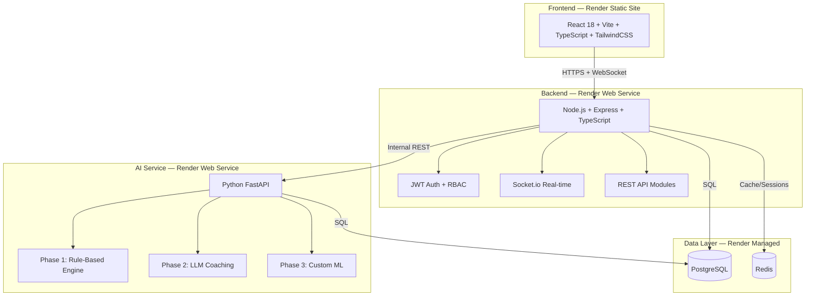

# VitalLoop

**AI-Powered Digital Health Platform** for diabetes risk management, weight management, and food habit intelligence.

Built around a continuous feedback loop:
**Input → AI Analysis → Behavioral Prediction → Personalized Guidance → User Action → Improved Outcome → Refined AI Model**

---

## Architecture



## Project Structure

```
VitalLoop/
├── frontend/               # React + Vite + TypeScript + TailwindCSS
│   ├── src/
│   │   ├── components/     # Reusable UI components
│   │   ├── pages/          # Route pages
│   │   ├── stores/         # Zustand state stores
│   │   ├── services/       # API service layer (Axios + React Query)
│   │   ├── hooks/          # Custom React hooks
│   │   ├── types/          # TypeScript type definitions
│   │   └── utils/          # Utility functions
│   └── ...
├── backend/                # Express + TypeScript API
│   ├── src/
│   │   ├── modules/        # Feature modules (auth, glucose, food, etc.)
│   │   ├── middleware/     # Express middleware
│   │   ├── database/       # Migrations + connection
│   │   ├── config/         # App configuration
│   │   └── utils/          # Shared utilities
│   └── ...
├── ai-service/             # Python FastAPI microservice
│   ├── routers/            # API route handlers
│   ├── models/             # ML model interfaces
│   ├── services/           # Business logic
│   └── ...
├── render.yaml             # Render Blueprint (one-click deploy)
├── .env.example            # Environment variable template
└── README.md               # This file
```

## Core Modules

| Module | Description |
|--------|-------------|
| **Breathing Engine** | Guided breathing sessions (paced, box, post-meal, sleep-prep) with stress/glucose correlation |
| **Food Habit Intelligence** | Meal logging, food search, photo recognition, glucose trigger detection |
| **Weight Management** | Longitudinal weight tracking with behavioral correlation analysis |
| **AI Prediction & Coaching** | Risk scoring, predictive warnings, conversational AI coach |

## User Roles

| Role | Access |
|------|--------|
| **Individual User** | Personal health tracking, AI coaching, alerts |
| **Healthcare Provider** | Patient dashboard, high-risk alerts, interventions |
| **Institution Admin** | Population analytics, risk stratification, compliance reports |
| **System** | Background jobs, AI prediction, notifications |

## Local Development Setup

### Prerequisites

- Node.js >= 18
- Python >= 3.10
- PostgreSQL >= 14
- Redis >= 6

### 1. Clone & Install

```bash
git clone <repo-url>
cd VitalLoop

# Frontend
cd frontend
npm install

# Backend
cd ../backend
npm install

# AI Service
cd ../ai-service
python -m venv venv
source venv/bin/activate  # Windows: venv\Scripts\activate
pip install -r requirements.txt
```

### 2. Configure Environment

```bash
# Copy env template and fill in values
cp .env.example frontend/.env
cp .env.example backend/.env
cp .env.example ai-service/.env
```

### 3. Database Setup

```bash
# Create database
createdb vitalloop

# Run migrations
cd backend
npm run migrate

# Seed demo data
npm run seed
```

### 4. Start Services

```bash
# Terminal 1: Frontend (port 5173)
cd frontend && npm run dev

# Terminal 2: Backend (port 3001)
cd backend && npm run dev

# Terminal 3: AI Service (port 8000)
cd ai-service && uvicorn main:app --reload --port 8000
```

## Render Deployment

1. Push code to GitHub/GitLab
2. In Render Dashboard, click **New** → **Blueprint**
3. Connect your repo and select `render.yaml`
4. Render will auto-provision all services, database, and cache
5. Set `ANTHROPIC_API_KEY` manually in the AI service's environment variables

## API Documentation

See individual module README files:
- [Auth API](backend/src/modules/auth/README.md)
- [Glucose API](backend/src/modules/glucose/README.md)
- [Food API](backend/src/modules/food/README.md)
- [Breathing API](backend/src/modules/breathing/README.md)
- [Weight API](backend/src/modules/weight/README.md)
- [Predictions API](backend/src/modules/predictions/README.md)
- [Coaching API](backend/src/modules/coaching/README.md)
- [Alerts API](backend/src/modules/alerts/README.md)
- [Analytics API](backend/src/modules/analytics/README.md)

## Tech Stack

| Layer | Technology |
|-------|-----------|
| Frontend | React 18, Vite, TypeScript, TailwindCSS v4, Zustand, React Query, Recharts, Socket.io-client |
| Backend | Node.js, Express, TypeScript, Socket.io, JWT, bcrypt, Zod |
| AI/ML | Python, FastAPI, scikit-learn, rule-based engines |
| Database | PostgreSQL, Redis |
| Deployment | Render (Static Site + Web Services + Managed DB + Key-Value) |

## License

Proprietary — All rights reserved.
